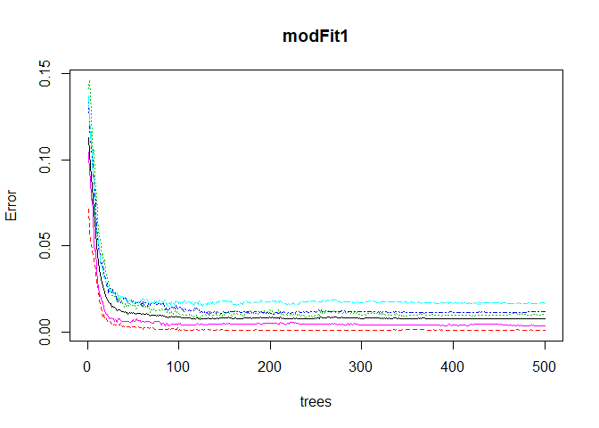
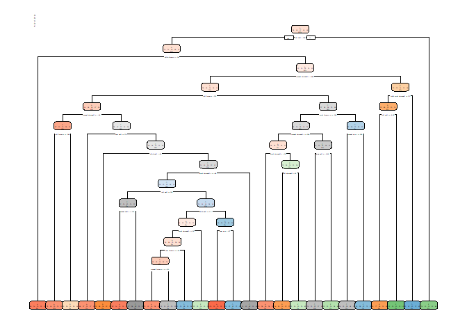

Course Project
================

Assingment
----------

Using devices such as Jawbone Up, Nike FuelBand, and Fitbit it is now possible to collect a large amount of data about personal activity relatively inexpensively. These type of devices are part of the quantified self movement - a group of enthusiasts who take measurements about themselves regularly to improve their health, to find patterns in their behavior, or because they are tech geeks. One thing that people regularly do is quantify how much of a particular activity they do, but they rarely quantify how well they do it. In this project, your goal will be to use data from accelerometers on the belt, forearm, arm, and dumbell of 6 participants. They were asked to perform barbell lifts correctly and incorrectly in 5 different ways. More information is available from the website here: <http://web.archive.org/web/20161224072740/http:/groupware.les.inf.puc-rio.br/har> (see the section on the Weight Lifting Exercise Dataset).

Data
----

The training data for this project are available here: <https://d396qusza40orc.cloudfront.net/predmachlearn/pml-training.csv>

The test data are available here: <https://d396qusza40orc.cloudfront.net/predmachlearn/pml-testing.csv>

The data for this project come from this source: <http://web.archive.org/web/20161224072740/http:/groupware.les.inf.puc-rio.br/har>.

There are the following five ways that barbell lifts were performed:

-   Class A: exactly according to the specification

-   Class B: throwing the elbows to the front

-   Class C: lifting the dumbbell only halfway

-   Class D: lowering the dumbbell only halfway

-   Class E: throwing the hips to the front

Objective
---------

The main objective of this report is to summarize the methodology on how to predict in which manner people performed barbell lifts. The outcome corresponds to the classe variable in the training set. All other variables can be used to explain and predict the outcome. The report is organized as follows. First, the data have been loaded and partitioned for the purpose of Cross-validation. After the datat have been cleaned two models were fitted on the test data. The final prediction is based on the model with highest performance.

Data Set
--------

The following packages have been used for the purpose of the analysis of this report:

``` r
library(caret)
```

    ## Loading required package: lattice

    ## Loading required package: ggplot2

``` r
library(randomForest)
```

    ## randomForest 4.6-12

    ## Type rfNews() to see new features/changes/bug fixes.

    ## 
    ## Attaching package: 'randomForest'

    ## The following object is masked from 'package:ggplot2':
    ## 
    ##     margin

``` r
library(rpart)
library(rpart.plot)
library(RColorBrewer)
```

Load the data into R

``` r
trainingData_URL <- "https://d396qusza40orc.cloudfront.net/predmachlearn/pml-training.csv"
testData_URL <- "https://d396qusza40orc.cloudfront.net/predmachlearn/pml-testing.csv"

# Load the training data 
train_data <- read.csv(url(trainingData_URL), na.strings=c("NA","#DIV/0!",""))
# Load the test data 
test_data <- read.csv(url(testData_URL), na.strings=c("NA","#DIV/0!",""))

# Perform the summary statistics on the classe variable from the Training data 
summary(train_data$classe)
```

    ##    A    B    C    D    E 
    ## 5580 3797 3422 3216 3607

Partitioning data for Cross-validation
--------------------------------------

The training data is split up into two data sets: 60% for training purposes and 40% for testing. The data is partitioned by the classe variable, which is to be predicted.

``` r
inTrain <- createDataPartition(y=train_data$classe, p = 0.60, list=FALSE)
training <- train_data[inTrain,]
testing <- train_data[-inTrain,]
dim(training)
```

    ## [1] 11776   160

``` r
dim(testing)
```

    ## [1] 7846  160

Data Cleaning
-------------

First the first 7 variables have been dropped due to the fact that thy have been made up of metadata. It could result in poor performance of the model.

``` r
training <- training[,-c(1:7)]
```

Remove NearZeroVariance variables

``` r
nzv <- nearZeroVar(training, saveMetrics=TRUE)
training <- training[, nzv$nzv==FALSE]
```

Drop variables that have 60% or more of the values as 'NA'.

``` r
training_clean <- training
for(i in 1:length(training)) {
  if( sum( is.na( training[, i] ) ) /nrow(training) >= .6) {
    for(j in 1:length(training_clean)) {
      if( length( grep(names(training[i]), names(training_clean)[j]) ) == 1)  {
        training_clean <- training_clean[ , -j]
      }   
    } 
  }
}

# Rewrite the new clean dataset to be a training data set
training <- training_clean
```

Transform the test\_data dataset in the form of training data set

``` r
columns <- colnames(training)
columns2 <- colnames(training[, -53])
test_data <- test_data[columns2]
dim(test_data)
```

    ## [1] 20 52

Model 1:Random Forest
---------------------

First the Random Forest model isfitted on the training dataset.Thereafter the results have been evaluated on the test dataset.

``` r
set.seed(1)
modFit1 <- randomForest(classe ~ ., data=training)
prediction1 <- predict(modFit1, testing)
cm1 <- confusionMatrix(prediction1, testing$classe)
print(cm1)
```

    ## Confusion Matrix and Statistics
    ## 
    ##           Reference
    ## Prediction    A    B    C    D    E
    ##          A 2231   11    0    0    0
    ##          B    0 1507   10    0    0
    ##          C    0    0 1352   10    3
    ##          D    0    0    6 1273    6
    ##          E    1    0    0    3 1433
    ## 
    ## Overall Statistics
    ##                                           
    ##                Accuracy : 0.9936          
    ##                  95% CI : (0.9916, 0.9953)
    ##     No Information Rate : 0.2845          
    ##     P-Value [Acc > NIR] : < 2.2e-16       
    ##                                           
    ##                   Kappa : 0.9919          
    ##  Mcnemar's Test P-Value : NA              
    ## 
    ## Statistics by Class:
    ## 
    ##                      Class: A Class: B Class: C Class: D Class: E
    ## Sensitivity            0.9996   0.9928   0.9883   0.9899   0.9938
    ## Specificity            0.9980   0.9984   0.9980   0.9982   0.9994
    ## Pos Pred Value         0.9951   0.9934   0.9905   0.9907   0.9972
    ## Neg Pred Value         0.9998   0.9983   0.9975   0.9980   0.9986
    ## Prevalence             0.2845   0.1935   0.1744   0.1639   0.1838
    ## Detection Rate         0.2843   0.1921   0.1723   0.1622   0.1826
    ## Detection Prevalence   0.2858   0.1933   0.1740   0.1638   0.1832
    ## Balanced Accuracy      0.9988   0.9956   0.9931   0.9940   0.9966

The model is 99.36% accurate based on the fit on the testing dataset partitioned from the training data. Thus based on accuracy the expected out of sample error is 0.01.

``` r
plot(modFit1)
```



As can be seen from the plot above the error rates of the model are plotted over 500 trees. In addition the error rate is less than 0.04 for all 5 classe.

Model 2: Decision Tree
----------------------

``` r
set.seed(1)
modFit2 <- rpart(classe ~ ., data=training, method="class")
prediction2 <- predict(modFit2, testing, type="class")
cm2 <- confusionMatrix(prediction2, testing$classe)
print(cm2)
```

    ## Confusion Matrix and Statistics
    ## 
    ##           Reference
    ## Prediction    A    B    C    D    E
    ##          A 2065  232   32   83   14
    ##          B   51  755   68   70   99
    ##          C   62  297 1155  141  199
    ##          D   37  111  106  884  100
    ##          E   17  123    7  108 1030
    ## 
    ## Overall Statistics
    ##                                           
    ##                Accuracy : 0.7506          
    ##                  95% CI : (0.7408, 0.7601)
    ##     No Information Rate : 0.2845          
    ##     P-Value [Acc > NIR] : < 2.2e-16       
    ##                                           
    ##                   Kappa : 0.6839          
    ##  Mcnemar's Test P-Value : < 2.2e-16       
    ## 
    ## Statistics by Class:
    ## 
    ##                      Class: A Class: B Class: C Class: D Class: E
    ## Sensitivity            0.9252  0.49736   0.8443   0.6874   0.7143
    ## Specificity            0.9357  0.95449   0.8921   0.9460   0.9602
    ## Pos Pred Value         0.8512  0.72387   0.6230   0.7141   0.8016
    ## Neg Pred Value         0.9692  0.88784   0.9645   0.9392   0.9372
    ## Prevalence             0.2845  0.19347   0.1744   0.1639   0.1838
    ## Detection Rate         0.2632  0.09623   0.1472   0.1127   0.1313
    ## Detection Prevalence   0.3092  0.13293   0.2363   0.1578   0.1638
    ## Balanced Accuracy      0.9304  0.72593   0.8682   0.8167   0.8372

The accuracy of Decision tree model is 75.06% on the testing data partitioned from the training data. Thus, the expected out of sample error is 0.25.

The plot od the decision tree model is presented below

``` r
rpart.plot(modFit2)
```



Final Prediction
----------------

In order to make a decision based on which model to perform the final prediction the accuracy of both models was taken into account. The Random Forest model gave an accuracy of 99.36, which is much higher compared to the accuracy from the Decision Tree ( 75.06% ). Thus the decision have been made to make use of Random Forest model to make the predictions on the test data to predict the way 20 participates performed the exercise.

``` r
pred_FINAL  <- predict(modFit1, test_data, type="class")
print(pred_FINAL)
```

    ##  1  2  3  4  5  6  7  8  9 10 11 12 13 14 15 16 17 18 19 20 
    ##  B  A  B  A  A  E  D  B  A  A  B  C  B  A  E  E  A  B  B  B 
    ## Levels: A B C D E

Conclusions
-----------

In this report two models have been performed: a Random Forest and Decision Tree model. Based on accuracy of both models the conclusion have been made. For this data, the Random Forest proved to be a more accurate way to predict the manner in which the exercise was done.
